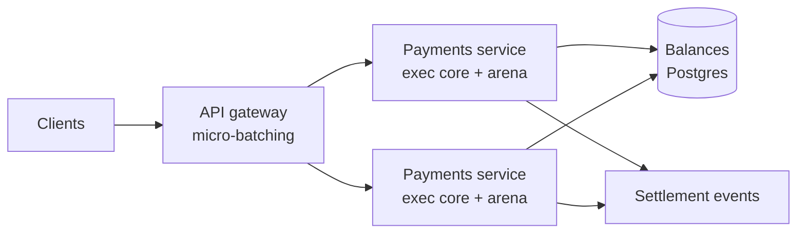
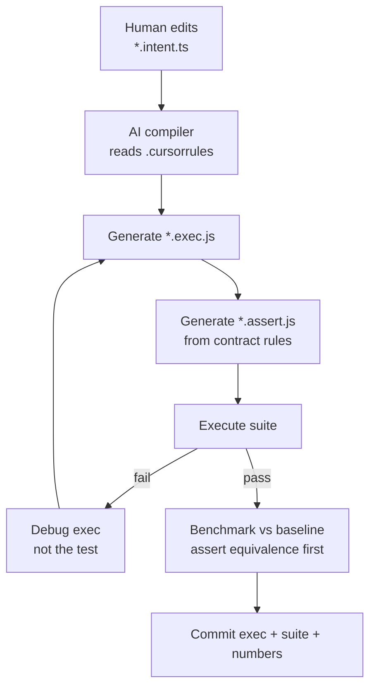

# Singularity

**An AI-native backend framework.** Humans write declarative intent contracts. A model compiles them into strictly procedural, TypedArray-backed execution units tuned for V8's optimizing tier. The generated code is unreadable by design; the contract and the generated test suite are what you maintain.

```
src/intents/<name>.intent.ts   →  [AI compiler]  →  src/exec/<name>.exec.js
        (you write this)          (.cursorrules)   +  tests/<name>.assert.js
```

The reference module is a bulk payment processor. It ships with a 26-rule contract, a 33-check loopback suite, and a 1M-record benchmark against an idiomatic implementation.

```bash
node bin/singularity.js check
```

```bash
node --expose-gc --max-old-space-size=6144 tests/benchmark.js
```

`check` gates three things mechanically: **drift** (is any exec unit older than the intent it was compiled from?), **verify** (every assert suite), and **decisions** (does every intent rule have recorded rationale?). Exit 0 means committable.

---

## Table of contents

- [Measured baseline](#measured-baseline)
- [Part 1 — Microservice architecture](#part-1--microservice-architecture)
- [Part 2 — Online applications](#part-2--online-applications)
- [Part 3 — Infrastructure economics](#part-3--infrastructure-economics)
- [Part 4 — The AI compiler loop](#part-4--the-ai-compiler-loop)
- [When not to use this](#when-not-to-use-this)
- [Roadmap](#roadmap)

---

## Measured baseline

Node v24.13.1, win32/x64, 1,000,000 payment records, 4,096 accounts. Output asserted byte-identical between both implementations *before* any timing was recorded. Reproduce with `npm run bench`.

| Phase | Best | Throughput | Per record |
|---|---|---|---|
| Idiomatic (objects, `.map`/`.filter`/`.reduce`) | 192.04 ms | 5.21 M rec/s | 192.0 ns |
| Singularity exec (reset + process) | 14.74 ms | 67.83 M rec/s | 14.7 ns |
| Singularity exec (traversal only) | 12.27 ms | 81.51 M rec/s | 12.3 ns |

| Memory | Idiomatic | Singularity |
|---|---|---|
| Allocation churn per batch | 210.23 MB | 4.7 KB |
| Input residency (1M records) | 144.96 MB, on-heap, GC-scanned | 18.15 MB, off-heap, not GC-scanned |

**13.0x** on the full batch, **15.7x** on the traversal, **5.9x** end-to-end including data ingest.

### The control that cuts that headline down

An adversarial audit of this repo asked the right question: is the baseline a strawman? [`tests/benchmark-honest.js`](tests/benchmark-honest.js) isolates the variables — the **same** AoS objects traversed by a competent plain for-loop with preallocated outputs and zero per-record allocation:

| Baseline | Best | vs exec |
|---|---|---|
| Idiomatic HOF style (`.reduce`, spread per record) | 192 ms | exec is **13x faster** |
| Honest plain loop over the same objects | 12.9 ms | exec is **0.88x — slightly slower** |

On this workload — which reads *every field* of every record — the SoA arena contributes **no traversal speedup at all**. The 13x is entirely attributable to the baseline's allocation style, which disciplined plain JavaScript also avoids. What the arena genuinely buys: **memory density** (18 MB off-heap vs 145 MB GC-scanned), **allocation churn** (4.7 KB vs 210 MB per batch, hence flat tail latency), **zero-copy worker sharing**, and wins on **partial-field scans** that this benchmark does not measure. Quote those, not the 13x.

### Read this before quoting those numbers

Three honest caveats, because the rest of this document depends on them:

1. **The allocation figures required a methodology correction.** A single-shot `heapUsed` delta around a ~15 ms window reported *+18.91 MB* for the exec path — an artifact, not garbage. V8 continues sweeping after `global.gc()` returns, so the delta grows with live-set size and elapsed time regardless of whether the measured code allocates. A no-op control of equal duration reported 4.88 MB. The benchmark now amortizes over 100 batches, samples the exec path before any object graph exists, and prints the no-op floor beside every figure. The 4.7 KB number is clean-heap and falsifiable.

2. **The speedup is on integer arithmetic over a dense batch.** Validation, truncating-integer fee math, a balance check, sequential mutation. Workloads dominated by string handling, I/O waits, or polymorphic data will not see 13x. Some will see 1x.

3. **13x on a hot loop is not 13x on a service.** This is the single most important caveat in this document, and [Part 3](#part-3--infrastructure-economics) is built around it rather than around the headline number.

---

## Part 1 — Microservice architecture

### 1.1 The batch boundary is the whole design

Singularity is fast because it amortizes fixed costs across a batch: one arena allocation, one set of hoisted view loads, one branch-predictor warmup, one pass of sequential prefetch. A service that calls `processBatch(L, 1)` per HTTP request throws all of that away and keeps only the ceremony.

**The architectural consequence: design service boundaries around batches, not entities.**

```
Chatty (defeats the framework)        Batched (what it's for)
POST /payment          x 10,000      POST /payments        x 1   (10,000 records)
  → processBatch(L, 1)                 → processBatch(L, 10000)
```

This is not a micro-optimization, it's an interface decision, and it is the one thing you cannot retrofit later. If your service contract is inherently one-entity-per-call, the framework has little to offer — use [micro-batching](#21-micro-batching-at-the-edge) or don't use Singularity for that path.

### 1.2 Extract hot paths; do not rewrite the service

The correct deployment is a thin exec core inside an otherwise ordinary service. Routing, auth, serialization, observability, and error mapping stay in idiomatic TypeScript where they belong.

```js
// payments-service.js — ordinary service code
const X = require('./src/exec/payment-processor.exec.js');

// allocated ONCE at process start, reused for the process lifetime
const LEDGER = X.allocLedger(65536, ACCOUNT_COUNT);

async function handleBatch(req, res) {
  const n = ingestInto(LEDGER, req.body);        // parse directly into the arena
  if (n < 0) return res.status(413).json({ error: 'BatchTooLarge' });

  X.resetLedger(LEDGER);
  await loadBalances(LEDGER.balances);            // I/O stays outside the hot loop
  X.processBatch(LEDGER, n);                      // ~15 ns/record

  return res.json(summarize(LEDGER, n));          // read stats out of the arena
}
```

Three rules make this work:

- **No I/O inside the loop.** Balances are loaded into `L.balances` before the call and flushed after. The exec unit is a pure function over the arena.
- **The arena outlives the request.** Allocating an arena per request reintroduces exactly the GC pressure you removed.
- **`resetLedger` before every batch.** It zeroes stats, fees, and statuses; balances are yours to seed.

### 1.3 Intents are service contracts you already needed

`payment-processor.intent.ts` is a TypeScript interface plus 26 numbered, machine-readable rules. It is simultaneously the compiler input, the API contract, the test specification, and the code review artifact. One file, and it is the only file a human edits.

This collapses a category of microservice drift. The usual failure — the OpenAPI spec, the validation layer, the tests, and the implementation each encoding a slightly different notion of "valid payment" — becomes structurally impossible, because all four are generated from one source and the generated suite fails if they disagree.

Rule strings are deliberately parseable (`"validate.2_amount_ceiling: ..."`, `"fee.3_priority: ..."`). Downstream generators can consume them:

| Generated from the intent | Status |
|---|---|
| `*.exec.js` execution unit | shipped |
| `*.assert.js` loopback suite | shipped |
| OpenAPI / JSON Schema for the batch endpoint | roadmap |
| Typed client SDK | roadmap |
| Error-state → HTTP status mapping | roadmap |

### 1.4 Zero-copy fan-out across workers

The arena is a `SharedArrayBuffer`. That is a deliberate choice with a specific payoff: `worker_threads` can operate on the same arena with **no structured clone, no serialization, no copy**. For a 145 MB object graph, `postMessage` would dominate everything the optimization saved. For an 18 MB shared arena, the transfer cost is passing a reference.

The shard-by-account pattern keeps this correct without locks. Account slots partition cleanly, so worker *k* owns slots where `slot % W === k` and no two workers ever touch the same balance:

```js
// main thread
const L = X.allocLedger(CAPACITY, ACCOUNT_COUNT);
for (let k = 0; k < W; k++) {
  new Worker('./payment-worker.js', {
    workerData: { arena: L.arena, capacity: CAPACITY, accountCount: ACCOUNT_COUNT, shard: k, shards: W }
  });
}
```

> **Partially implemented.** `attachLedger(arena, capacity, accountCount)` now exists and is tested: `tests/arena.assert.js` verifies that attach rebuilds byte-identical views over an existing buffer without copying, that writes are visible in both directions, and that a dims mismatch is rejected rather than silently producing overlapping views.
>
> **The sharded traversal above is still not implemented.** `processBatch` has no shard parameter, so there is no exec-level support for "process only the records belonging to shard k", and nothing in the suite covers concurrent workers over one arena. The memory plumbing is proven; the parallel algorithm is not. Do not deploy this pattern yet. See [Roadmap](#roadmap).

### 1.5 Deployment topology



Nothing exotic. The framework changes what happens *inside* a pod, not the shape of the cluster. That is a feature: it means adoption is incremental and reversible, one endpoint at a time.

---

## Part 2 — Online applications

### 2.1 Micro-batching at the edge

Online traffic arrives as individual requests, which is exactly the shape the framework is worst at. Micro-batching bridges the gap: hold arriving requests for a few milliseconds, process the accumulated window in one pass, then resolve every caller.

```js
const WINDOW_MS = 5;
const pending = [];  // { record, resolve }
let timer = null;

function submit(record) {
  return new Promise(resolve => {
    pending.push({ record, resolve });
    if (pending.length >= LEDGER.capacity) return void flush();
    if (timer === null) timer = setTimeout(flush, WINDOW_MS);
  });
}

function flush() {
  clearTimeout(timer); timer = null;
  const batch = pending.splice(0, pending.length);
  const n = batch.length;

  for (let i = 0; i < n; i++) writeRecordInto(LEDGER, i, batch[i].record);
  X.resetLedger(LEDGER);
  seedBalances(LEDGER.balances);
  X.processBatch(LEDGER, n);

  for (let i = 0; i < n; i++) {
    batch[i].resolve({ status: LEDGER.statuses[i], fee: LEDGER.fees[i] });
  }
}
```

The tradeoff is explicit and tunable: **you add up to `WINDOW_MS` of latency to buy batch efficiency.** At 5 ms and measured throughput, a full 65,536-record window costs under 1 ms of compute — the window, not the work, dominates. Set `WINDOW_MS` from your latency budget, not from throughput math.

Note the ordering subtlety this introduces: records within a batch are processed in arrival order and balance mutations are visible to later records in the same batch (contract rule R1). Two requests against the same account in one window are serialized deterministically — which is usually what you want, but it means batch composition is observable in the results. Do not treat batching as purely an implementation detail.

### 2.2 Fixed capacity is free admission control

`allocLedger(capacity, accountCount)` fixes capacity at startup. Under load this is a feature: the arena cannot grow, so there is a hard, predictable ceiling on in-flight work. Overflow is a fast rejection rather than a slow memory-pressure death spiral.

```js
if (pending.length >= LEDGER.capacity) {
  return res.status(429).set('Retry-After', '1').json({ error: 'Backpressure' });
}
```

Most Node services degrade under overload by growing the heap until GC thrashing collapses throughput — the worst failure mode, because it destroys the healthy traffic too. A fixed arena converts that into explicit backpressure at a known threshold.

### 2.3 Tail latency is the real online win

For interactive traffic, p99 matters more than mean, and this is where the allocation numbers pay off more than the throughput numbers.

The idiomatic path churns **210 MB per batch**. Sustain a few batches per second and you are allocating at ~1 GB/s, which drives continuous scavenges and periodic major GC over a large live set. Those pauses land on unrelated in-flight requests — the classic symptom of a service whose mean latency looks fine and whose p99 is unexplainable.

The exec path allocates **4.7 KB per batch** and keeps its working set off-heap where the mark-sweep collector never scans it. There is nothing to collect, so there is no pause to attribute.

Since capacity planning for interactive services is driven by p99 against an SLO — not by mean throughput — a flatter tail translates more directly into fewer instances than raw speed does.

### 2.4 Browsers: read this before trying

The same exec unit runs unmodified in a browser, but `SharedArrayBuffer` is gated behind cross-origin isolation. You must serve:

```
Cross-Origin-Opener-Policy: same-origin
Cross-Origin-Embedder-Policy: require-corp
```

Cross-origin isolation will break third-party embeds, some ad and analytics tags, and any iframe not serving CORP headers. This is frequently a blocker on real consumer sites, and it is a site-wide decision, not a per-page one. Verify `crossOriginIsolated === true` before assuming the arena is available, and keep a fallback path.

If isolation is not viable, declare the arena with `shared: false` and the runtime allocates a plain `ArrayBuffer` instead — you keep the SoA layout, the zero-allocation traversal, and nearly all of the single-threaded win, losing only cross-worker sharing. **This is implemented and tested** (`non-shared mode yields a plain ArrayBuffer`), though the payment exec unit currently declares `shared: true`; flipping it is a one-line schema change.

One further browser constraint: the runtime builds handles with `new Function`, which a strict CSP blocks without `unsafe-eval`. See [0006](decisions/0006-schema-driven-arena-runtime.md) for why codegen is load-bearing rather than incidental.

---

## Part 3 — Infrastructure economics

This section is deliberately the most skeptical part of the document. Every figure below is a **model with stated assumptions**, not a measurement. The only measured numbers in this README are in [Measured baseline](#measured-baseline).

### 3.1 Why 13x compute does not mean 13% of the bill

Amdahl's law governs, and it is unforgiving. If the payment loop is 10% of your request budget and the other 90% is Postgres round-trips, TLS, JSON, and framework overhead:

```
speedup = 1 / (0.90 + 0.10/13) = 1.10x
```

**A 13x kernel produced a 10% service-level improvement.** Anyone selling you the 13x as an infrastructure number is selling you a benchmark, not a service.

There is a sharper version of this. At realistic request rates, the arithmetic was **never your bottleneck**. Measured single-core throughput is 67.83 M rec/s; a service sustaining 500,000 records/sec needs roughly 0.007 of one core for the payment logic. You do not have a compute problem at that scale, and optimizing compute cannot save you money you were not spending.

So the honest question is not "how much faster is the loop" but **"what was I actually paying for?"** For most Node services the answer is memory and GC behavior — which is where this framework's advantage is largest and least advertised.

### 3.2 Where the savings actually are

**Memory density (usually the binding constraint).** In Kubernetes, pod density per node is typically limited by memory requests, not CPU. The measured difference in resident input alone is 145 MB versus 18 MB, with per-batch churn of 210 MB versus 4.7 KB. Churn is what forces heap headroom: you must provision for peak allocation plus GC slack, not for live data.

*Model, assumptions stated:*

| | Idiomatic | Singularity |
|---|---|---|
| Live working set | ~145 MB | ~18 MB |
| Headroom for churn + GC slack (assumed 2.5x churn) | ~526 MB | ~0 |
| Realistic container limit | 1 GB | 256 MB |
| Pods per 64 GB node, less ~6% node overhead | ~60 | ~240 |

Same workload, roughly **4x pod density**, so roughly **75% fewer nodes** on the memory-bound dimension. This model assumes memory is your binding constraint and that CPU, connection limits, and file descriptors are not. Verify that before believing it.

**Tail-latency provisioning.** Interactive fleets are sized so p99 meets an SLO. Removing GC pauses from the tail lets the same SLO be met with fewer replicas. The size of this effect depends entirely on how much of your current p99 is GC, which you can measure directly (`--trace-gc`, or `perf_hooks` GC observers) before committing to anything.

**Compute, but only at genuine scale.** Batch and stream processing — settlement runs, reconciliation, risk scoring, backfills, ETL — is where 13x is straightforwardly 13x, because the workload really is a dense arithmetic pass over a large dataset with no I/O interleaved. This is the framework's home territory, far more than request/response serving.

### 3.3 The cost that moves in the wrong direction

Intellectual honesty requires the other side of the ledger:

- **The exec code is unreadable on purpose.** Debugging a production incident means reading the intent and the test suite, not the flattened loop. Teams without that discipline will suffer.
- **Regeneration risk.** Changing an intent means recompiling, and the new exec is only as trustworthy as the generated suite. The 32 checks here were written to be adversarial *because* the implementation is not human-auditable at a glance. Weak generated tests turn this framework into a liability.
- **The ingest boundary can eat the entire win.** If records arrive as JSON, `JSON.parse` costs far more than the 12 ms traversal, and marshalling objects into the arena costs another 14 ms (measured). **The arena only pays off if data enters it once and stays there** — parse at the edge directly into typed arrays and never materialize an object. A service that parses to objects and then packs has paid both costs to save neither. This single issue is the most common way an adoption fails.
- **JIT warmup.** The 13x requires TurboFan tier-up. Short-lived serverless invocations may never reach it, and the first requests after a cold start run in the interpreter or baseline tier.
- **AI generation and verification cost.** Real, but one-time per intent revision, and amortized against recurring infrastructure spend. That asymmetry — one-time generation against monthly compute — is the actual economic thesis of the framework.

### 3.4 Decide with measurements

The framework's own ruleset ([`.cursorrules`](.cursorrules) §7–8) forbids reporting a speedup without asserting equivalence first, and forbids hiding marshalling outside the timed region. Apply the same standard to your adoption decision:

1. Profile the service. Establish what fraction of the request budget is the candidate hot path. If it is under ~20%, stop — Amdahl caps your upside at 25% and the maintenance cost is not worth it.
2. Measure GC contribution to p99 (`--trace-gc`). This is often the larger prize and it is cheap to quantify.
3. Confirm memory is the binding constraint on density before modelling node savings.
4. Check the ingest path. If you cannot parse directly into the arena, model the marshalling cost explicitly and re-evaluate.
5. Port one endpoint. Compare against production, not against a benchmark.

---

## Part 4 — The AI compiler loop

### 4.1 The pipeline



The loop is closed and self-verifying: the compiler cannot report success without a green suite, and cannot report a speedup without first asserting output equivalence. Both constraints are normative in [`.cursorrules`](.cursorrules), and both fired during this module's own construction — two test failures surfaced, both traced to errors in the generated tests rather than the exec, and corrected against the contract's arithmetic.

That is the property that makes the approach viable at all. Unreadable generated code is only safe when verification is mandatory, adversarial, and mechanical.

### 4.2 Continuous compilation

Treat the exec unit as a build artifact under test, not as source:

```yaml
- name: Verify exec matches intent
  run: node tests/payment-processor.assert.js

- name: Guard against performance regression
  run: node --expose-gc --max-old-space-size=6144 tests/benchmark.js
```

A useful CI discipline is to fail the build when an intent's modification time exceeds its exec's, forcing recompilation rather than allowing silent drift between contract and implementation.

### 4.3 Self-optimizing generation

The benchmark harness is machine-readable, which makes the optimization loop automatable: generate a candidate variant, assert equivalence, measure, keep the winner, discard the rest. Candidates worth sweeping include branch ordering by observed selectivity, `Int32Array` versus `Float64Array` for running totals, arena field ordering for cache locality, and shard counts for the worker fan-out.

The discipline that makes this safe is already in the ruleset: **equivalence is asserted before timing is reported**, so a variant that is faster and wrong is rejected automatically rather than benchmarked approvingly.

### 4.4 What "AI-native" is actually buying

Not code generation — that is the mechanism, not the value. The value is that **the optimization ceiling stops being bounded by what a human will maintain.**

Nobody hand-writes flattened, hand-inlined, arena-offset code with an adversarial suite for a fee calculation, because the maintenance cost is indefensible against the benefit. When generation and verification are mechanical, that calculus inverts: the human maintains a 26-rule contract that reads like a specification, and the machine-hostile implementation becomes disposable. Regenerate it when the contract changes; never read it.

The infrastructure saving is downstream of that inversion, and it is the honest version of the pitch: not "AI writes faster code," but "AI removes the maintenance cost that previously made this class of optimization irrational."

---

## When not to use this

Reach for something else when:

- **The hot path is under ~20% of the request budget.** Amdahl caps the payoff below the maintenance cost.
- **The workload is I/O-bound.** Optimizing 0.007 of a core changes nothing.
- **Data cannot enter the arena once.** If you must parse to objects anyway, you pay marshalling to save arithmetic you were not spending.
- **The domain is genuinely polymorphic.** Heterogeneous records with optional fields fight monomorphism and SoA layout at every turn.
- **The team will not maintain the contract-plus-suite discipline.** Unreadable code without mandatory adversarial verification is a liability, not an optimization.
- **Records must be processed individually with strict per-item latency** and micro-batching is not acceptable.

Singularity is a scalpel for dense, arithmetic-heavy, batch-shaped work. Applied to a service that is mostly waiting on a database, it adds risk and buys nothing.

---

## Roadmap

Ordered by how much they unblock, with current status stated honestly:

| Item | Status |
|---|---|
| Schema-driven arena runtime (`src/runtime/arena.js`) | **shipped** — 23-check suite, hidden-class identity verified via `%HaveSameMap` |
| `attachLedger` for zero-copy worker fan-out (§1.4) | **shipped** — memory sharing proven both directions |
| `ArrayBuffer` fallback for non-isolated browser contexts (§2.4) | **shipped** — `shared: false` on any schema |
| Decision records + coverage enforcement (`docs/DECISIONS.md`) | **shipped** — 26/26 rules documented, stale references fail the build |
| CLI (`drift` / `verify` / `decisions` / `layout` / `check`) | **shipped** |
| Sharded traversal + concurrent-worker coverage | **not implemented** — §1.4's parallel algorithm is unproven |
| Direct JSON-to-arena ingest (removes the boundary cost in §3.3) | **not implemented** — highest-leverage remaining item |
| Fee-table bounds validation at startup (`MIN > MAX` is currently unchecked) | **not implemented** — see [0007](decisions/0007-fee-clamp-order.md) |
| OpenAPI / JSON Schema generation from intent rules | roadmap |
| Typed client SDK generation | roadmap |
| Automated variant sweep with equivalence gating (§4.3) | roadmap |
| Ring-buffer arena mode for streaming | roadmap |

---

## Repository layout

| Path | Role |
|---|---|
| [`.cursorrules`](.cursorrules) | Compiler ruleset — normative |
| [`CLAUDE.md`](CLAUDE.md) | Entry point for agents |
| [`docs/STRUCTURE.md`](docs/STRUCTURE.md) | **Why there are two trees** — read this first |
| [`docs/DECISIONS.md`](docs/DECISIONS.md) | Decision-record format and workflow |
| [`bin/singularity.js`](bin/singularity.js) | CLI — the enforcement surface |
| [`features/payments/`](features/payments/) | Feature: money movement (`bulk-settlement`) |
| [`features/clients/`](features/clients/) | Feature: client cards and visit profiling |
| [`src/exec/`](src/exec/) | Generated execution units — flat, never hand-edited |
| [`src/runtime/arena.js`](src/runtime/arena.js) | Schema-driven arena allocator |
| [`tests/`](tests/) | Framework suites, shared lint, benchmark |
| [`examples/`](examples/) | Runnable adoption scenarios |
| [`decisions/`](decisions/) | Framework-wide decisions |

Humans navigate `features/`; machines run `src/exec/`. Exec units are generated and never read, so the two trees are free to diverge — see [docs/STRUCTURE.md](docs/STRUCTURE.md).

### Invariants

- Never add logic to an `*.intent.ts` file.
- Never modify an `*.exec.js` without re-running its assert suite.
- Money is integer minor units; rates are basis points with truncating division.
- Never report a speedup without asserting output equivalence first.
- Exec units declare memory layout; they never compute byte offsets by hand.
- A new or changed intent rule needs a decision record or an explicit waiver.
